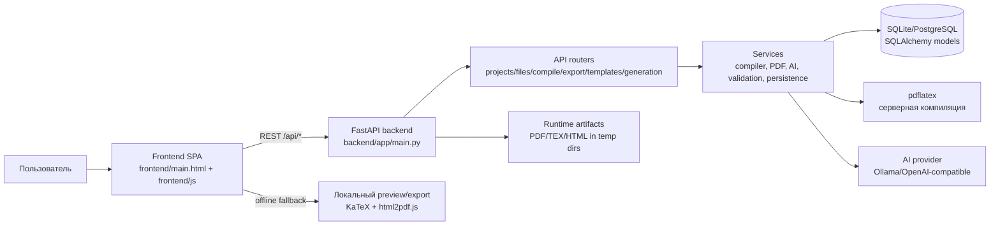
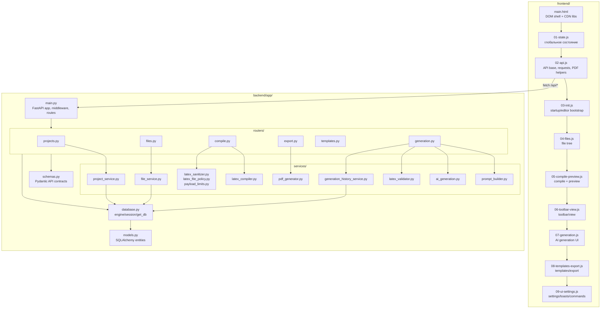
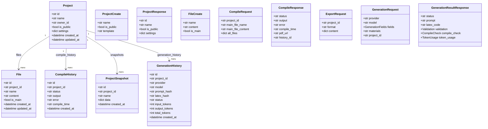
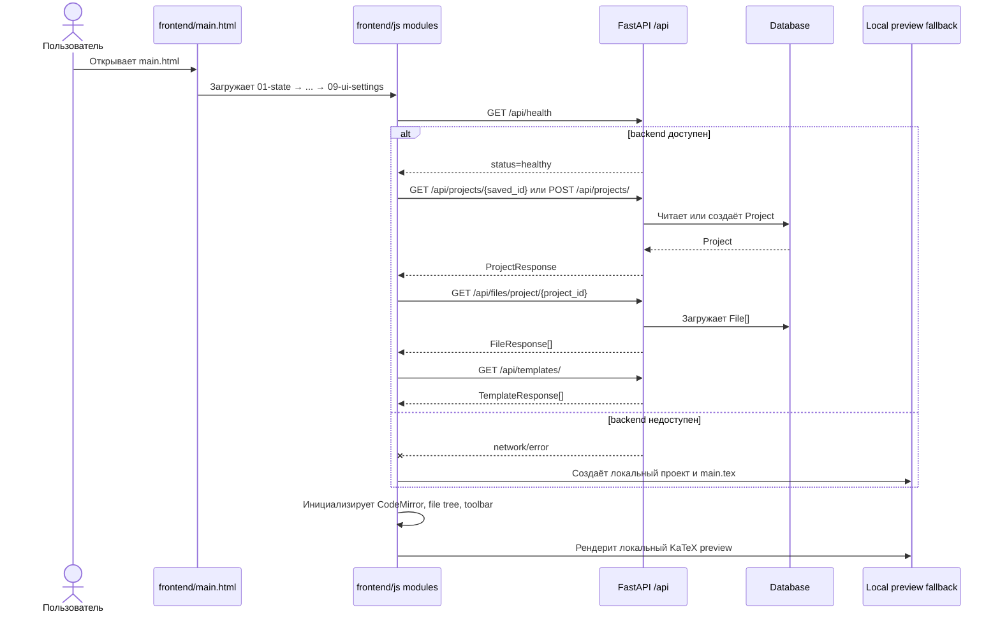
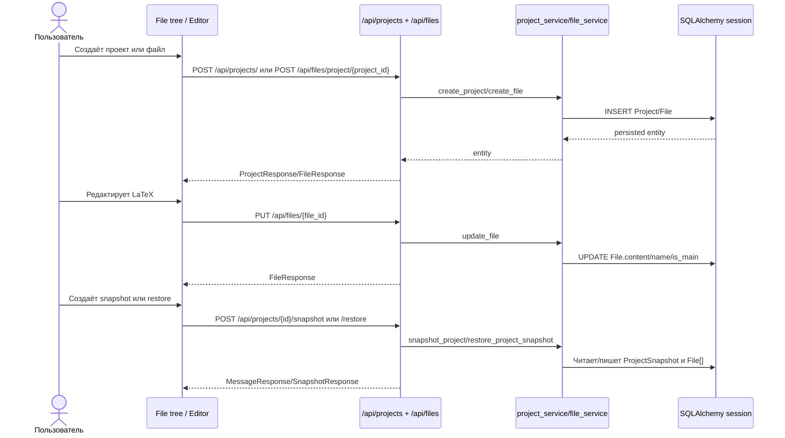
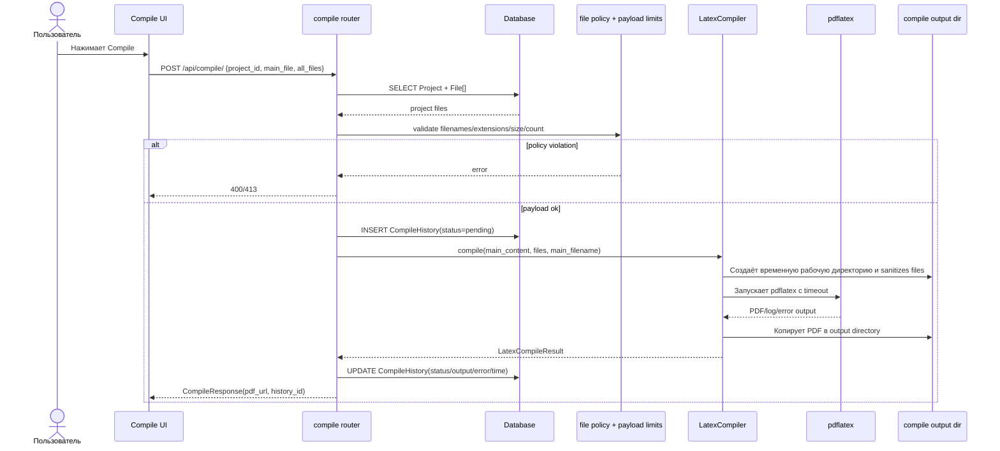
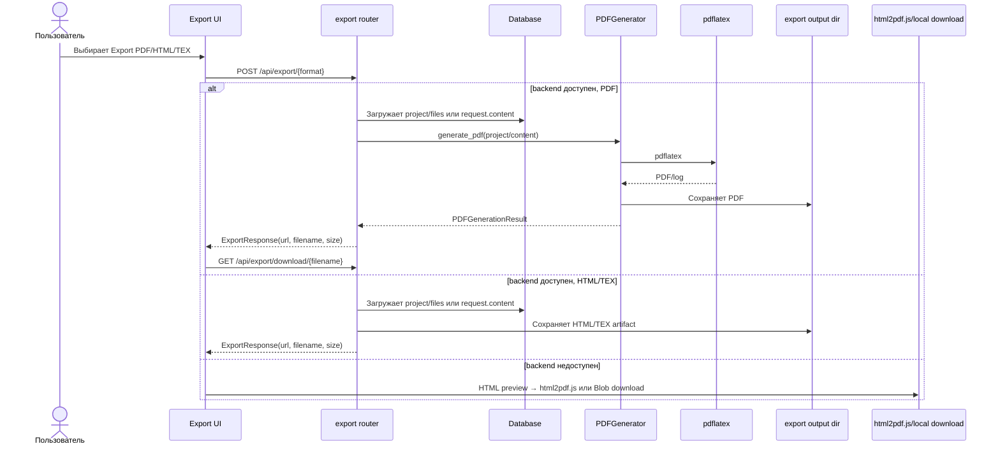
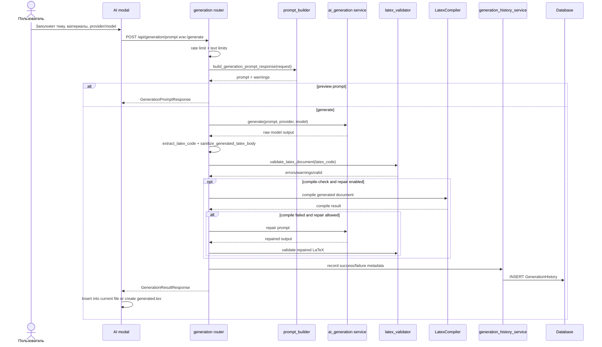
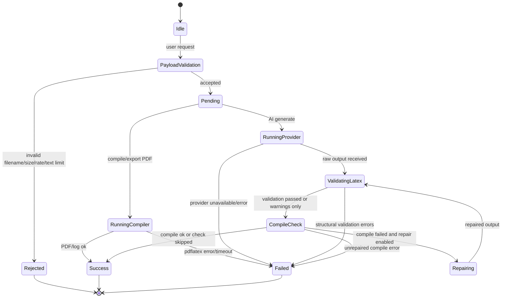
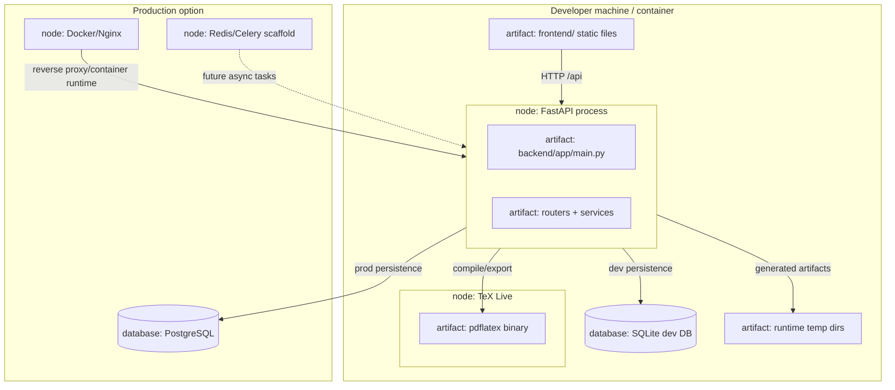

# UML-диаграммы работы Latexed

Этот документ описывает работу репозитория Latexed через UML-диаграммы в формате Mermaid. Диаграммы построены по текущей структуре проекта: FastAPI backend, браузерный SPA frontend, SQLAlchemy-модели, сервисы компиляции/export/AI и Alembic-миграции.

## 1. Контекст системы

Latexed — онлайн-редактор LaTeX. Пользователь работает в браузере с CodeMirror/KaTeX/PDF.js, frontend вызывает REST API backend, backend хранит проекты и файлы в базе данных, запускает `pdflatex` для серверной компиляции/export и обращается к AI-провайдеру для генерации LaTeX.

## 2. Компонентная диаграмма backend и frontend

Основная архитектурная граница backend: `Router → Service → Database/session/model`. Часть CRUD-роутеров всё ещё работает с SQLAlchemy напрямую как существующий legacy-паттерн, но новая нетривиальная логика должна уходить в сервисы.

## 3. Диаграмма классов данных и API-контрактов

SQLAlchemy-модели представляют persisted-сущности, а Pydantic-схемы задают контракты API и границы сервисов.

## 4. Последовательность запуска приложения в браузере

Frontend загружается как набор ordered browser scripts. При старте он определяет адрес API, проверяет `/api/health`, загружает/создаёт проект, получает файлы и шаблоны, затем инициализирует редактор и preview. Если backend недоступен, сохраняется локальная работоспособность preview/export fallback.

## 5. Последовательность CRUD для проектов и файлов

Файловые операции проходят через frontend tree/editor, API-роутеры и сервисы/модели. Для проектов доступны создание, чтение, обновление, удаление, snapshots, restore и duplicate.

## 6. Последовательность серверной компиляции LaTeX

Серверная компиляция получает файлы проекта или raw-content, валидирует имена/расширения и лимиты payload, создаёт запись истории, запускает `pdflatex` в изолированной временной директории и возвращает ссылку на PDF или ошибку.

## 7. Последовательность export PDF/HTML/TEX

Export-роутер поддерживает форматы PDF, HTML и TEX. PDF использует сервис генерации PDF и `pdflatex`; HTML/TEX формируются как скачиваемые артефакты. Frontend сохраняет локальные fallback-варианты, если backend недоступен.

## 8. Последовательность AI-генерации LaTeX

AI-flow отделяет сбор полей, построение prompt, provider call, извлечение LaTeX, структурную validation, опциональный compile-check/repair и запись истории. Логи используют метаданные, хэши и размеры вместо полного prompt/LaTeX.

## 9. Состояния compile/generation задач

## 10. Развёртывание и runtime-зависимости

> Примечание: Mermaid не имеет единого стандартного `deploymentDiagram` во всех renderer-ах, поэтому deployment view намеренно оформлен как совместимый `flowchart TB` с UML-терминами `node`, `artifact` и `database` в подписях.
